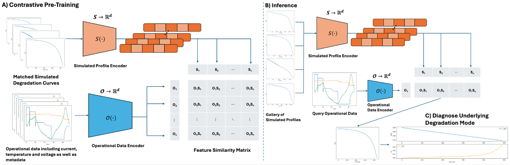

# ACCEPT

Modeling lithium-ion battery (LIB) degradation offers significant cost savings and enhances the safety and reliability of electric vehicles (EVs) and battery energy storage systems (BESS).
Recently, data-driven methods have received great attention to forecast degradation, but often demonstrate limited generalization ability and tend to underperform particularly in critical scenarios involving accelerated degradation, which are crucial to predict accurately. These methods also fail to elucidate the underlying causes of degradation. While physical models provide a deeper understanding, their complex parameters and inherent uncertainties limit their applicability in real-world settings. To this end, we propose a new model -- ACCEPT. Our framework uses contrastive learning to map the relationship between the underlying physical degradation parameters and observable operational quantities. Furthermore, due to the similarity of degradation paths between LIBs with the same chemistry, this model transfers non-trivially to most downstream tasks, allowing for zero-shot inference. Additionally, since categorical features can be included in the model, it can generalize to other LIB chemistries. This work enables a foundational battery degradation model, providing reliable forecasts across a range of battery types and operating conditions

## Approach

